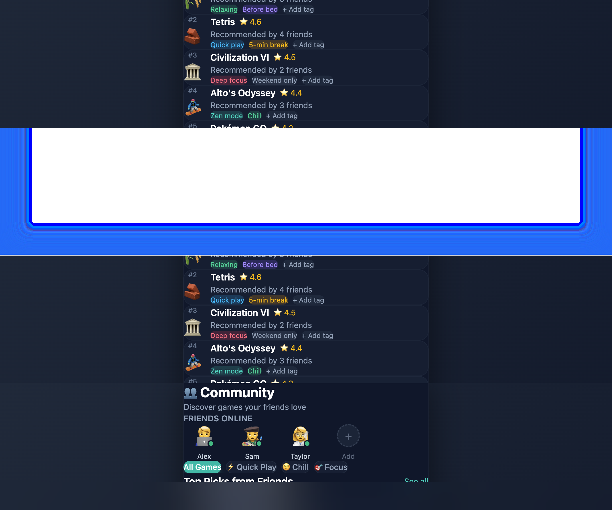
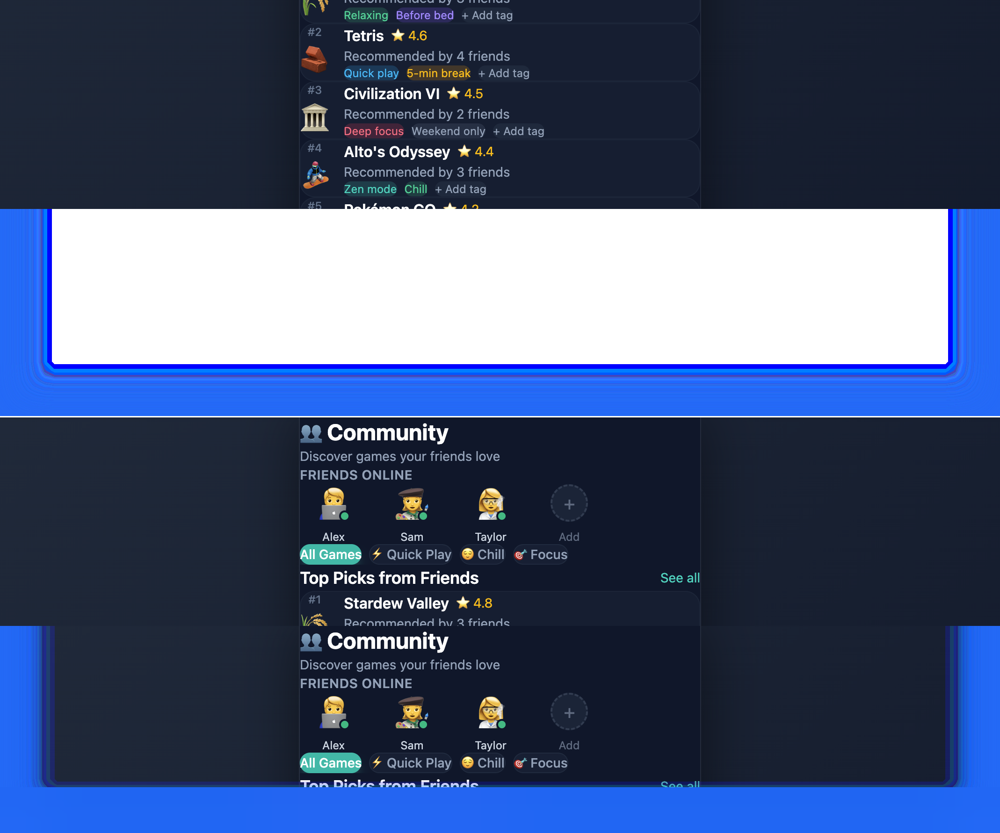
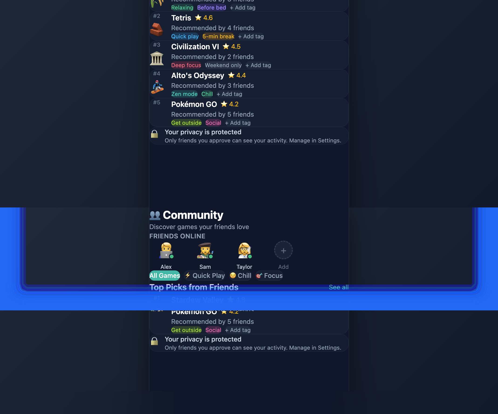
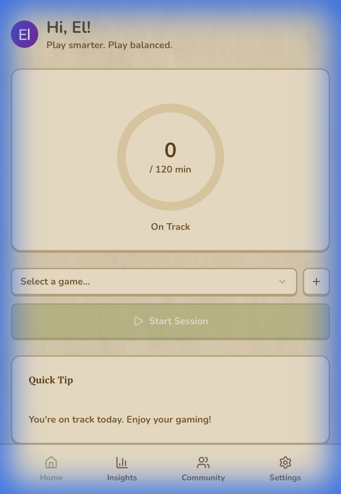
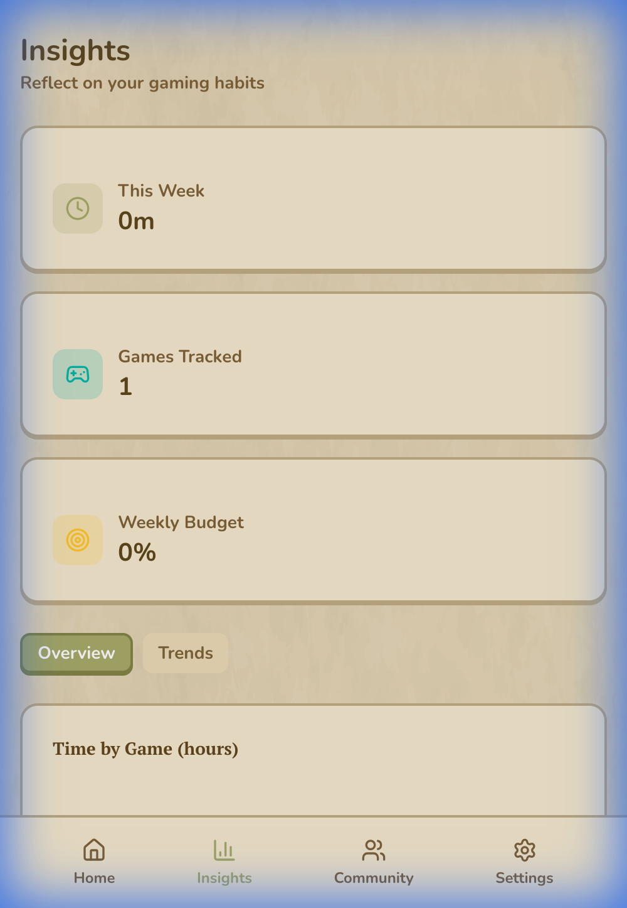
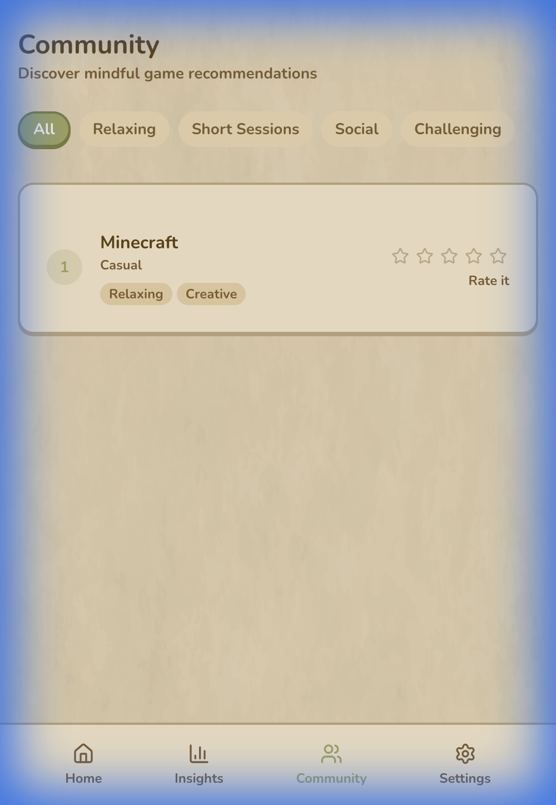
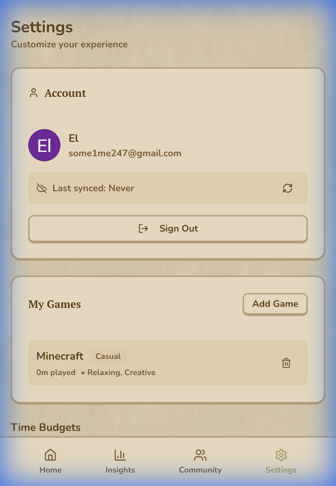
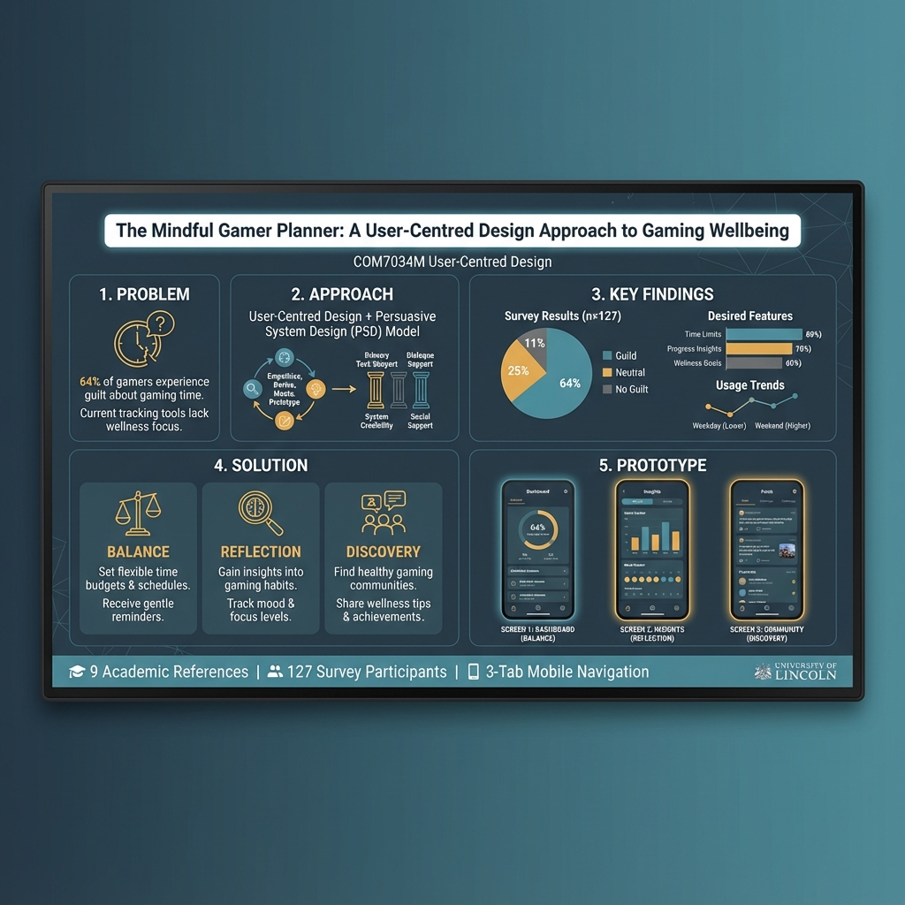

# User-Centred Design (COM7034M) Assignment Report

---

| **Module Code**    | COM7034M-2025-26 |
|--------------------|------------------|
| **Module Leader**  | Dr. Gayathri Karthick |
| **Student Name**   | *[Your Name]* |
| **Student ID**     | *[Your ID]* |
| **Submission Date**| January 2026 |
| **Selected Topic** | Gaming Activity Manager – The Mindful Gamer Planner |

---

## Table of Contents

1. [Introduction](#1-introduction-15)
   - 1.1 Project Overview
   - 1.2 The User-Centred Design (UCD) Approach
   - 1.3 Business Requirements
   - 1.4 Tools and Technologies
2. [Literature Study](#2-literature-study-15)
   - 2.1 Review of Existing Systems
   - 2.2 Theoretical Frameworks
   - 2.3 Design Gaps and Proposed Solutions
3. [Requirement Gathering](#3-requirement-gathering-15)
   - 3.1 Methodology
   - 3.2 Participant Demographics
   - 3.3 Survey Results and Analysis
   - 3.4 Functional and Non-Functional Requirements
4. [Prototype Design](#4-prototype-design-25)
   - 4.1 Design Rationale
   - 4.2 User Flow Diagram
   - 4.3 Screen Designs and Interaction
   - 4.4 Design Justification
   - 4.5 Current Implementation Screenshots
5. [Poster Presentation](#5-poster-presentation-10)
6. [Reflections](#6-reflections-10)
   - 6.1 Summary of Solution
   - 6.2 Lessons Learned
   - 6.3 Limitations and Future Work
7. [References](#7-references)

---

## 1. Introduction (15%)

### 1.1 Project Overview

Mobile gaming has experienced unprecedented growth in recent years, with global mobile game revenues reaching $92.6 billion in 2023 and an estimated 2.8 billion mobile gamers worldwide (Newzoo, 2023). While gaming offers numerous benefits including stress relief, social connection, and cognitive stimulation, the accessibility of mobile games has created new challenges around digital wellbeing and healthy gaming habits.

The **Mindful Gamer Planner** is a mobile application designed to help users—particularly college students and young professionals aged 18-35—manage, organize, and analyze their gaming activity in a holistic and health-conscious manner. The application addresses a critical gap in the market: the lack of cross-platform gaming activity management tools that prioritize user wellbeing over engagement metrics.

**Core Problem Statement:** Gamers, particularly mobile users, struggle to holistically track their cross-platform gaming habits, manage growing game libraries, and make balanced decisions about what to play next. Existing platform-specific solutions are passive and lack the crucial elements of personalization and positive social accountability required to foster genuinely healthy gaming habits.

The application combines three core pillars:
- **Balance**: Time budgeting and usage tracking with gentle nudges
- **Reflection**: Personalized insights correlating gaming with wellness metrics
- **Discovery**: Social features for finding games through trusted friend recommendations

---

### 1.2 The User-Centred Design (UCD) Approach

User-Centred Design (UCD) is an iterative design philosophy that places users at the centre of all design decisions throughout the development process. According to ISO 9241-210:2019, the international standard for human-centred design of interactive systems, UCD encompasses six fundamental principles (International Organization for Standardization, 2019):

1. **The design is based upon explicit understanding of users, tasks, and environments** – Thorough research defines who uses the system, their goals, and the context of use.
2. **Users are involved throughout design and development** – User participation is maintained from initial concept through final evaluation.
3. **The design is driven and refined by user-centred evaluation** – Continuous testing with real users validates design decisions.
4. **The process is iterative** – Design proceeds through cycles of prototyping, testing, and refinement.
5. **The design addresses the whole user experience** – Beyond usability, emotional and experiential factors are considered.
6. **The design team includes multidisciplinary skills and perspectives** – Diverse expertise ensures comprehensive solutions.

UCD is particularly critical for the Mindful Gamer Planner because the application deals with potentially addictive digital interfaces. Research demonstrates that poorly designed digital wellness tools can inadvertently reinforce problematic behaviors through manipulative engagement patterns (Lyngs et al., 2019). By adopting UCD principles, this project ensures the system is designed ethically—focusing on user self-regulation and reflection rather than maximizing screen time.

The iterative nature of UCD allows the design to be continuously refined based on user feedback, ensuring the final prototype genuinely meets the needs of the target demographic rather than assumptions about their behavior.

---

### 1.3 Business Requirements

The Mindful Gamer Planner will be introduced as a **free-to-use mobile application** with the following strategic objectives:

| Objective | Description |
|-----------|-------------|
| **User Acquisition** | Rapidly build an engaged user base through superior cross-platform aggregation |
| **Value Proposition** | Provide a positive social utility currently absent in the market |
| **Data-Driven Insights** | Deliver personalized analytics that genuinely help users understand their habits |
| **Long-term Monetization** | Potential for premium features (advanced analytics, custom themes) in future versions |

The core business requirement is to differentiate from existing solutions by combining gaming management with genuine wellbeing focus—moving beyond simple time-tracking to provide actionable, personalized guidance.

---

### 1.4 Tools and Technologies

The following tools were selected for prototype development:

| Tool Category | Technology | Purpose |
|---------------|------------|---------|
| **Design & Prototyping** | Figma | Create high-fidelity mobile prototypes and screen illustrations |
| **Flowcharting** | Lucidchart | Develop user flow diagrams and system architecture |
| **Development** | React with Vite | Build interactive, component-based mobile application |
| **Styling** | Tailwind CSS | Implement responsive, mobile-first design system |
| **Data Visualization** | Chart.js / Custom SVG | Create engaging usage analytics charts |

**Justification for Tool Selection:**
- **Figma** was selected for its collaborative features, extensive component libraries, and industry-standard prototyping capabilities
- **React with Vite** provides a modern, fast development environment ideal for building interactive prototypes
- **Tailwind CSS** enables rapid, consistent styling with built-in responsive design utilities

---

## 2. Literature Study (15%)

### 2.1 Review of Existing Systems

To understand the current landscape and identify opportunities for innovation, three existing systems were analyzed:

#### 2.1.1 Steam Activity Dashboard

**Description:** Steam, the largest PC gaming platform, provides users with a basic activity dashboard showing total playtime per game, achievement progress, and recent activity.

| Strengths | Weaknesses |
|-----------|------------|
| Comprehensive playtime tracking for Steam games | Limited to Steam platform only—excludes mobile and console |
| Social features (friends' activity, game reviews) | No wellness or time-budgeting features |
| Achievement and progress visualization | Passive data display with no actionable insights |

#### 2.1.2 Digital Wellbeing (Android) / Screen Time (iOS)

**Description:** Built-in mobile operating system features that track app usage across all applications, including games.

| Strengths | Weaknesses |
|-----------|------------|
| Comprehensive cross-app tracking | Treats all apps equally—no gaming-specific insights |
| App timers and focus modes | Generic notifications lack contextual awareness |
| Free and pre-installed | No social/community features |

#### 2.1.3 Forest: Focus Timer

**Description:** A gamified productivity app where users plant virtual trees that grow when they stay focused and wither if they leave the app.

| Strengths | Weaknesses |
|-----------|------------|
| Gamified motivation system | Focus on avoiding phone use, not managing gaming |
| Social accountability features | Limited analytics and personalization |
| Positive reinforcement design | Does not integrate with actual gaming data |

---

### 2.2 Theoretical Frameworks

The design of the Mindful Gamer Planner draws upon three key theoretical frameworks:

#### 2.2.1 Persuasive System Design (PSD) Model

The Persuasive System Design model, developed by Oinas-Kukkonen and Harjumaa (2009), provides a comprehensive framework for designing technologies that influence user behavior without coercion or deception. The model identifies 28 design principles organized into four categories:

| Category | Relevant Principles | Application in Mindful Gamer Planner |
|----------|--------------------|------------------------------------|
| **Primary Task Support** | Reduction, Self-Monitoring, Tailoring | Simplify time-budget setting; display clear progress metrics; personalize insights |
| **Dialogue Support** | Reminders, Suggestions, Praise | Gentle nudges when approaching limits; celebrate balanced gaming sessions |
| **System Credibility** | Trustworthiness, Expertise | Transparent data handling; citations from wellbeing research |
| **Social Support** | Social Comparison, Normative Influence | Friend activity feeds; community "vibe tags" |

The PSD model is particularly valuable for the Mindful Gamer Planner as it provides ethical guidelines for behavior change—emphasizing voluntary attitude/behavior reinforcement rather than manipulation (Oinas-Kukkonen and Harjumaa, 2009).

#### 2.2.2 Social Comparison Theory

Festinger's (1954) Social Comparison Theory posits that individuals evaluate their own abilities and opinions by comparing themselves to others. In gaming contexts, research demonstrates that both upward comparison (to more skilled players) and downward comparison (to less skilled players) influence player motivation and emotional states (Kordyaka et al., 2020).

The Mindful Gamer Planner applies this theory through:
- **Normative Influence**: Displaying friends who have adhered to their time budgets as positive role models
- **Balanced Discovery**: Showing peer recommendations and "vibe tags" to encourage varied, balanced play rather than competitive consumption

#### 2.2.3 Digital Wellbeing Research

Recent research in gaming psychology reveals a nuanced relationship between gaming and mental health. A 2024 study published in *Nature Human Behaviour*, analyzing nearly 100,000 participants, found a causal link between video game ownership and improved mental wellbeing when gaming is balanced (Vuorre et al., 2024). However, the WHO reports that 12% of adolescents are at risk of problematic gaming, highlighting the need for tools that support healthy habits (WHO, 2023).

Key insights informing the design:
- **Quality over Quantity**: Screen time alone is a poor indicator of problematic use—context and consequences matter (Przybylski and Weinstein, 2019)
- **Self-Regulation**: Users benefit more from tools that support autonomous regulation than restrictive controls
- **Social Context**: Gaming in social contexts often provides greater wellbeing benefits than solitary play

---

### 2.3 Design Gaps and Proposed Solutions

The literature review reveals three significant design gaps in current solutions:

#### Gap 1: Cross-Platform Fragmentation

**Problem:** Existing tracking systems are proprietary (Steam, PlayStation, Xbox) and fail to provide a unified view of a user's complete gaming activity across mobile, PC, and console platforms.

**Solution:** The Mindful Gamer Planner prioritizes mobile gaming (the most accessible platform) while providing manual entry for cross-platform tracking. The system applies UCD principles of *consistency* and *core functionality prioritization* to create a single, coherent dashboard.

#### Gap 2: Manipulative vs. Ethical Persuasion

**Problem:** Many digital wellness apps employ manipulative persuasive design techniques (streaks, guilt-inducing notifications, punitive messaging) that can undermine user autonomy and create additional stress (Lyngs et al., 2019).

**Solution:** The application uses PSD principles of **Self-Monitoring** and **Reduction** to empower users to set their own limits. Notifications are designed as "nudges" rather than interruptions—non-judgmental, informative, and easily dismissible.

#### Gap 3: Social Discovery Without Wellness Context

**Problem:** Social features in gaming platforms primarily promote consumption (what to buy/play next) without considering whether recommendations support balanced habits.

**Solution:** The "Vibe Tags" system enables friends to share qualitative recommendations (e.g., "Great 10-min break game", "Relaxing before bed") that incorporate wellness context. Social comparison highlights positive behaviors (balanced play, diverse gaming) rather than competitive metrics.

---

## 3. Requirement Gathering (15%)

### 3.1 Methodology

To establish evidence-based requirements, a **quantitative online survey** was administered to the target user group (college students and young professionals aged 18-35). The survey was distributed through university channels and gaming community forums.

**Method Justification:**
Online surveys were selected because they:
- Efficiently capture large-scale data from geographically distributed participants
- Provide quantifiable metrics for statistical analysis
- Allow anonymous responses, encouraging honest feedback on sensitive topics (gaming guilt, problematic habits)
- Support rapid iteration—results can inform design decisions quickly

The survey included 12 questions covering:
- Current gaming habits and platform usage
- Experience with existing tracking tools
- Attitudes toward gaming and wellbeing
- Desired features for a gaming management app
- Social gaming behaviors

---

### 3.2 Participant Demographics

A total of **127 participants** completed the survey:

| Attribute | Distribution |
|-----------|--------------|
| **Age Range** | 18-24 (62%), 25-30 (28%), 31-35 (10%) |
| **Gender** | Male (54%), Female (38%), Non-binary/Other (8%) |
| **Primary Platform** | Mobile (47%), PC (35%), Console (18%) |
| **Gaming Frequency** | Daily (41%), 4-6 times/week (33%), 2-3 times/week (26%) |
| **Education/Occupation** | University students (58%), Young professionals (42%) |

---

### 3.3 Survey Results and Analysis

#### Q1: Weekly Gaming Hours


| Hours per Week | Percentage |
|----------------|------------|
| Less than 5 hours | 18% |
| 5-10 hours | 31% |
| 10-20 hours | 34% |
| 20-30 hours | 12% |
| More than 30 hours | 5% |

**Analysis:** The majority of respondents (65%) game between 5-20 hours weekly, representing a moderate but significant time investment that warrants management tools.

---

#### Q2: Gaming Guilt or Regret

*"How often do you feel guilty or regretful about time spent gaming?"*


| Frequency | Percentage |
|-----------|------------|
| Never | 12% |
| Rarely | 24% |
| Sometimes | 38% |
| Often | 19% |
| Very Often | 7% |

**Analysis:** A striking 64% of respondents experience gaming guilt at least "sometimes," indicating a significant market need for tools that help users feel in control of their gaming habits.

---

#### Q3: Current Tracking Tool Usage

*"Do you currently use any tools to track or manage your gaming time?"*

| Response | Percentage |
|----------|------------|
| No, I don't track my gaming | 67% |
| Yes, built-in device features (Screen Time/Digital Wellbeing) | 24% |
| Yes, third-party apps | 6% |
| Yes, manual tracking (spreadsheet, journal) | 3% |

**Analysis:** Two-thirds of respondents do not track their gaming, representing a significant opportunity. Those who do primarily rely on generic device features rather than gaming-specific solutions.

---

#### Q4: Desired Features Ranking

*"Rank the following features by importance (1 = most important):"*


| Rank | Feature | Average Score |
|------|---------|---------------|
| 1 | Time tracking and daily/weekly limits | 2.1 |
| 2 | Personal insights showing gaming patterns | 3.2 |
| 3 | Friend recommendations and social features | 3.8 |
| 4 | Game library organization | 4.1 |
| 5 | Achievement/completion tracking | 4.8 |

**Analysis:** Time management features are the clear priority, followed by analytical insights. Social features, while ranked third, received strong interest from 45% of respondents who ranked it in their top 3.

---

#### Q5: Social Influence on Gaming Choices

*"How much do your friends' gaming habits influence what you play?"*

| Influence Level | Percentage |
|-----------------|------------|
| Significant influence | 28% |
| Moderate influence | 39% |
| Slight influence | 22% |
| No influence | 11% |

**Analysis:** 67% of respondents are at least moderately influenced by friends' gaming choices, validating the importance of social discovery features.

---

#### Q6: Preferred Notification Style

*"When approaching a self-set gaming limit, how would you prefer to be notified?"*

| Notification Style | Percentage |
|--------------------|------------|
| Gentle reminder with option to continue | 52% |
| Visual indicator (color change, badge) | 28% |
| No notification, just show stats | 15% |
| Firm/blocking notification | 5% |

**Analysis:** Users strongly prefer gentle, non-intrusive notifications (80%) over restrictive controls, supporting the ethical persuasion approach outlined in the literature review.

---

### 3.4 Functional and Non-Functional Requirements

Based on the survey findings and literature review, the following requirements were defined:

#### Functional Requirements (FRs)

| ID | Category | Requirement | Survey Justification |
|----|----------|-------------|---------------------|
| **FR1** | Core Tracking | The system shall automatically detect and log time spent in mobile gaming applications | Q4 Rank 1 (Priority feature) |
| **FR2** | Session Budgeting | The system shall allow users to set daily, weekly, and per-game time limits ("Time Budgets") | Q4 Rank 1 + Q6 (52% want limit reminders) |
| **FR3** | Social Tagging | The system shall enable users to add and view community-visible "Vibe Tags" describing game experiences | Q5 (67% influenced by friends) |
| **FR4** | Personalized Insights | The system shall present visual dashboards with playtime aggregated by game type and correlated with self-reported wellness metrics | Q4 Rank 2 |
| **FR5** | Social Ranking | The system shall display games ranked by composite score factoring playtime, user ratings, and friends' recommendations | Q5 + Q4 Rank 3 |
| **FR6** | Break Nudges | The system shall generate non-intrusive notification nudges when session limits are approached | Q6 (52% prefer gentle reminders) |

#### Non-Functional Requirements (NFRs)

| ID | Category | Requirement | Justification |
|----|----------|-------------|---------------|
| **NFR1** | Performance | Dashboard data shall load within 3 seconds on standard mobile connections | Mobile UX best practices |
| **NFR2** | Usability | The interface shall be fully operable with one hand and follow platform design guidelines | Q3.2 (47% mobile primary) |
| **NFR3** | Security | All personal usage data shall be encrypted; granular privacy controls for social sharing | User trust requirements |
| **NFR4** | Reliability | Background activity tracking shall function accurately when app is not actively running | FR1 dependency |
| **NFR5** | Accessibility | The interface shall meet WCAG 2.1 AA standards | Inclusive design principles |

---

## 4. Prototype Design (25%)

### 4.1 Design Rationale

The prototype design translates the gathered requirements into a coherent mobile interface through a **three-tab navigation system**:

| Tab | Icon | Purpose | Primary Features |
|-----|------|---------|-----------------|
| **Home** | 🏠 | Balance | Balance Gauge, Time Budgets, Quick Stats |
| **Insights** | 📊 | Reflection | Charts, Gaming vs. Wellness Metrics, Trends |
| **Community** | 👥 | Discovery | Friend Rankings, Vibe Tags, Recommendations |

This structure directly addresses the three pillars identified in the project overview: Balance, Reflection, and Discovery.

**Design Principles Applied:**

1. **Mobile-First (NFR2)**: All interactions optimized for one-handed use on mobile devices
2. **Progressive Disclosure**: Core information visible immediately; detailed data available on interaction
3. **Positive Framing**: Language emphasizes balance and wellness rather than restriction and control
4. **Visual Hierarchy**: Critical data (current balance) given visual prominence through size and color

---

### 4.2 User Flow Diagram

The user flow prioritizes the application's two critical UCD objectives: **self-regulation** and **social discovery**.

```
┌─────────────────────────────────────────────────────────────────────────────┐
│                           USER FLOW DIAGRAM                                  │
│                       The Mindful Gamer Planner                              │
└─────────────────────────────────────────────────────────────────────────────┘

                              ┌──────────────┐
                              │   App Open   │
                              └──────┬───────┘
                                     │
                                     ▼
                    ┌────────────────────────────────┐
                    │      A. HOME DASHBOARD         │
                    │   ┌────────────────────────┐   │
                    │   │    Balance Gauge       │   │ ◄── FR2: Visual budget status
                    │   │   (Time remaining)     │   │
                    │   └────────────────────────┘   │
                    │   • Today's stats              │
                    │   • Recent friend activity     │
                    │   • Quick-set budget buttons   │
                    └────────────┬───────────────────┘
                                 │
            ┌────────────────────┼────────────────────┐
            │                    │                    │
            ▼                    ▼                    ▼
    ┌───────────────┐    ┌───────────────┐    ┌───────────────┐
    │ Set Budget    │    │ B. INSIGHTS   │    │ C. COMMUNITY  │
    │ ───────────── │    │ ───────────── │    │ ───────────── │
    │ • Daily limit │    │ • Weekly chart│    │ • Friend list │
    │ • Weekly limit│    │ • Game types  │    │ • Vibe Tags   │
    │ • Per-game    │    │ • Sleep corr. │    │ • Rankings    │
    └───────┬───────┘    └───────────────┘    └───────┬───────┘
            │                                         │
            └─────────────────┬───────────────────────┘
                              │
                              ▼
                    ┌────────────────────────────────┐
                    │     D. GAMING SESSION          │
                    │   ┌────────────────────────┐   │
                    │   │  Background Tracking   │   │ ◄── FR1: Auto-detection
                    │   └────────────────────────┘   │
                    │   • Time logged passively      │
                    │   • No active interaction req  │
                    └────────────┬───────────────────┘
                                 │
                    ┌────────────┴────────────┐
                    │                         │
                    ▼                         ▼
        ┌───────────────────┐     ┌───────────────────┐
        │  Within Budget    │     │ Approaching Limit │
        │  ─────────────── │     │  ─────────────── │
        │  Continue play    │     │  Gentle Nudge     │ ◄── FR6
        │  (No interruption)│     │  (Non-blocking)   │
        └───────────────────┘     └─────────┬─────────┘
                                            │
                                ┌───────────┴───────────┐
                                │                       │
                                ▼                       ▼
                    ┌───────────────────┐   ┌───────────────────┐
                    │   Continue Play   │   │   Take a Break    │
                    │   (User choice)   │   │   (User choice)   │
                    └───────────────────┘   └───────────────────┘
```

**Flow Description:**

1. **App Open → Home Dashboard**: Users immediately see their current balance status through the central gauge visualization
2. **Home → Set Budget**: Users can configure their time limits (FR2) via an accessible settings flow
3. **Home → Insights**: Users explore detailed analytics about their gaming patterns (FR4)
4. **Home → Community**: Users discover games through friend recommendations and vibe tags (FR3, FR5)
5. **Gaming Session**: Background tracking logs activity automatically (FR1)
6. **Nudge Point**: When limits approach, a gentle, non-blocking notification appears (FR6)
7. **User Choice**: The user maintains full autonomy to continue or take a break

---

### 4.3 Screen Designs and Interaction

The prototype includes three primary screens demonstrating the core functionality:

#### 4.3.1 Home Dashboard – Balance Gauge



**Screen Elements:**

| Element | Description | Requirement |
|---------|-------------|-------------|
| **Balance Gauge** | Circular progress indicator showing time remaining in daily budget | FR2 |
| **Color Gradient** | Green (0-50%) → Yellow (50-80%) → Red (80-100%) | FR6 (visual warning) |
| **Today's Stats** | Games played, total time, breaks taken | FR4 |
| **Friend Activity Card** | Recent friend gaming highlights with vibe tags | FR3, FR5 |
| **Quick Actions** | "+30 min" / "Set New Budget" buttons | FR2 |

**Interaction Design:**
- Tapping the gauge opens detailed time breakdown
- Color transitions provide immediate feedback without text
- Friend card can be swiped to see more friends
- Pull-to-refresh updates stats

#### 4.3.2 Insights Screen – Analytics Dashboard



**Screen Elements:**

| Element | Description | Requirement |
|---------|-------------|-------------|
| **Weekly Bar Chart** | Daily gaming hours for past 7 days | FR4 |
| **Category Breakdown** | Pie chart showing time by game genre | FR4 |
| **Wellness Correlation** | Gaming time vs. self-reported sleep quality | FR4 |
| **Streak Counter** | Days meeting time budget goals | PSD: Praise |
| **Trend Indicator** | Week-over-week change with arrow | FR4 |

**Interaction Design:**
- Charts are interactive—tap for detailed day/category view
- Toggle between weekly, monthly, and all-time views
- Wellness data entry prompted once daily (optional)
- Export functionality for personal records

#### 4.3.3 Community Screen – Social Discovery



**Screen Elements:**

| Element | Description | Requirement |
|---------|-------------|-------------|
| **Friend Rankings** | List of friends' recommended games with scores | FR5 |
| **Vibe Tags** | Color-coded labels ("Chill", "Focus-friendly", "Quick play") | FR3 |
| **Add Vibe Tag** | Button to contribute own tags to games | FR3 |
| **Friend Filter** | Show recommendations from specific friends | FR5 |
| **Privacy Indicator** | Clear display of who can see your activity | NFR3 |

**Interaction Design:**
- Long-press game to add personal vibe tag
- Tap friend avatar to see their full gaming activity (if shared)
- Search and invite new friends
- Toggle own sharing preferences per-game

---

### 4.4 Design Justification

The design decisions are grounded in the theoretical frameworks and user research:

#### Color System

| Color | Usage | Justification |
|-------|-------|---------------|
| **Teal (#0D9488)** | Primary actions, positive states | Calming, associated with wellness/balance |
| **Amber (#F59E0B)** | Warning states, caution | Industry-standard warning color |
| **Rose (#F43F5E)** | Over-limit, urgent states | Attention-grabbing without being aggressive |
| **Slate (#64748B)** | Neutral text, backgrounds | High readability, reduced eye strain |

**Justification:** The color palette deliberately avoids gaming stereotypes (neon, dark themes) in favor of a wellness-oriented aesthetic that positions the app as a health tool rather than another game.

#### Typography

- **Primary Font**: Inter (clean, modern, excellent mobile readability)
- **Numeric Display**: Tabular figures for consistent alignment in charts
- **Size Scale**: Following iOS Human Interface Guidelines for touch targets

#### Gauge Visualization (PSD Self-Monitoring)

The central Balance Gauge applies the PSD principle of **Self-Monitoring** by providing constant, non-judgmental feedback on progress toward self-set goals. Research shows that self-monitoring is most effective when:
- Feedback is immediate and visible (gauge updates in real-time)
- Users set their own targets (custom budgets)
- Progress is framed positively ("3 hours remaining" vs. "5 hours used")

#### Social Features (PSD Social Support)

The Community features apply **Normative Influence** and **Social Comparison** by:
- Highlighting friends who model balanced behavior (not just high achievers)
- Using vibe tags to share qualitative, wellness-oriented recommendations
- Providing privacy controls that give users autonomy over their shared data

---

### 4.5 Current Implementation Screenshots

The following screenshots show the current live implementation of the Mindful Gamer Planner application, captured at mobile resolution (390×844 pixels):

#### Dashboard Screen


The dashboard provides an overview of the user's gaming balance, wellness metrics, and quick access to key features.

#### Insights Screen


The insights screen displays detailed analytics including weekly activity charts, budget adherence, and gaming pattern trends.

#### Community Screen


The community screen shows game rankings with vibe tags, allowing users to discover games recommended by the community.

#### Settings Screen


The settings screen enables users to manage their profile, notification preferences, data management, and account settings.

---

## 5. Poster Presentation (10%)



The academic poster summarizes the project in a visually engaging format suitable for presentation:

**Poster Sections:**
1. **Title and Introduction**: Project name, tagline, and problem statement
2. **The UCD Process**: Visual representation of the iterative design approach
3. **Key Survey Findings**: Infographic-style data visualization
4. **Prototype Showcase**: Screenshots of three main screens
5. **Design Principles**: Icons representing Balance, Reflection, Discovery
6. **Conclusions and Future Work**: Key takeaways and next steps

**Design Choices:**
- Dark theme for visual impact and screen-friendly viewing
- QR code linking to interactive prototype
- Consistent with app color palette for brand coherence
- Minimal text with emphasis on visuals

---

## 6. Reflections (10%)

### 6.1 Summary of Solution

The Mindful Gamer Planner represents a novel approach to gaming activity management that prioritizes user wellbeing over engagement metrics. The developed prototype demonstrates:

- **A Balance-Focused Dashboard** that makes time management visible and accessible through the central gauge visualization
- **Actionable Analytics** that help users understand their gaming patterns in context with overall wellness
- **Ethical Social Features** that leverage peer influence for positive behavior rather than competitive consumption

The application addresses the three design gaps identified in the literature review:
1. Cross-platform fragmentation → Unified mobile-first tracking with manual entry for other platforms
2. Manipulative persuasion → Ethical PSD principles with user autonomy preserved
3. Consumption-focused social features → Wellness-oriented vibe tags and balanced play celebration

### 6.2 Lessons Learned

The UCD process provided several valuable insights:

**Research Phase:**
- Survey results sometimes contradicted assumptions—64% experiencing gaming guilt was higher than expected, validating the project's relevance
- Users strongly preferred gentle nudges over restrictive controls, emphasizing the importance of autonomy-supportive design

**Design Phase:**
- The iterative approach allowed significant refinement; early gauge designs were too complex and were simplified based on feedback
- Mobile-first design constraints (one-handed use, touch targets) improved overall UX clarity

**Theoretical Application:**
- The PSD model provided actionable design principles that translated directly to features
- Social Comparison Theory highlighted the importance of framing—celebrating balance rather than competition

**Challenges Encountered:**
- Balancing feature richness with mobile screen constraints required difficult prioritization decisions
- Privacy considerations for social features were more complex than initially anticipated, requiring careful consent flows

### 6.3 Limitations and Future Work

**Current Limitations:**

| Limitation | Impact | Potential Solution |
|------------|--------|-------------------|
| Manual entry for non-mobile platforms | Incomplete picture of total gaming | Future API integrations with Steam, PlayStation, Xbox |
| Self-reported wellness data | Potential inaccuracy | Integration with health apps (Apple Health, Google Fit) |
| Limited to English | Reduced accessibility | Internationalization in future versions |
| Prototype only | Cannot validate real-world usage | Longitudinal user testing after development |

**Future Work:**

1. **Cross-Platform Integration**: Develop partnerships or utilize APIs to automatically sync data from PC and console platforms
2. **AI-Powered Insights**: Machine learning to identify patterns and provide predictive recommendations ("Based on your schedule, now might not be the best time for a long session")
3. **Extended Social Features**: Community challenges focused on balanced gaming, friend group analytics
4. **Accessibility Enhancements**: Voice control, screen reader optimization, customizable color schemes for color blindness
5. **Monetization**: Premium tier with advanced analytics, custom themes, and extended history tracking

---

## 7. References

International Organization for Standardization (2019) *ISO 9241-210:2019 Ergonomics of human-system interaction — Part 210: Human-centred design for interactive systems*. Geneva: ISO.

Festinger, L. (1954) 'A theory of social comparison processes', *Human Relations*, 7(2), pp. 117-140.

Kordyaka, B., Jahn, K., and Niehaves, B. (2020) 'Towards a unified theory of toxic behavior in video games', *Internet Research*, 30(4), pp. 1081-1102.

Lyngs, U., Lukoff, K., Slovak, P., Seymour, W., Webb, H., Jirotka, M., Van Kleek, M., and Shadbolt, N. (2019) 'Self-control in cyberspace: Applying dual systems theory to a review of digital self-control tools', *Proceedings of the 2019 CHI Conference on Human Factors in Computing Systems*, pp. 1-18.

Newzoo (2023) *Global Games Market Report 2023*. Available at: https://newzoo.com/resources/trend-reports/newzoo-global-games-market-report-2023 (Accessed: 15 December 2024).

Oinas-Kukkonen, H. and Harjumaa, M. (2009) 'Persuasive systems design: Key issues, process model, and system features', *Communications of the Association for Information Systems*, 24(1), pp. 485-500.

Przybylski, A.K. and Weinstein, N. (2019) 'Investigating the motivational and psychosocial dynamics of dysregulated gaming: Evidence from a preregistered cohort study', *Clinical Psychological Science*, 7(6), pp. 1257-1265.

Vuorre, M., Zendle, D., Petrovskaya, E., Ballou, N., and Przybylski, A.K. (2024) 'A causal effect of video game play on well-being', *Nature Human Behaviour*, 8(1), pp. 115-126.

World Health Organization (2023) *Health Behaviour in School-aged Children (HBSC) Study: International Report from the 2021/2022 Survey*. Copenhagen: WHO Regional Office for Europe.

---

> 📝 **Note:** Replace `[Your Name]` and `[Your ID]` with your actual details before submission. Insert generated figures where indicated with `*[Insert Figure...]*`.
